# Arduino-Based Busch 2090 Microtronic Emulators 
## Arduino-based Emulators of the Vintage Busch 2090 Microtronic Computer System from 1981 
#### Authors: 
- [Michael Wessel](http://www.michael-wessel.info/): Original Emulators & Next Generation Emulator 
- Frank de Jaeger: 2nd Generation Microtronic PCB 
- Manfred Henf: 2nd Generation Microtronic 3D Design & Printing 
- Martin Sauter: Busch 2095 Cassette Interface Protocol Reengineering & Research
- Lilly (https://github.com/ducatimaus/Busch-2090): Breakpoint & Single Stepping Integration for Uno R3 Version 

#### License: GPL 3
#### [YouTube Videos](https://www.youtube.com/playlist?list=PLvdXKcHrGqhekyx81EoCwQij1Lqylp0dB) 

## Abstract

This repository contains a number of Arduino-based emulators of the 
Busch 2090 Microtronic Computer System. 

The Microtronic was an educational 4bit single-board computer system of
the early 1980s, manufactured by the company Busch Modellbau in
Germany: 

 

This is the Microtronic of the author; on the left you see
the 2095 Cassette Interface (the breadboard & Arduino R3 contraption 
connected to the Microtronic is an Arduino-based speech synthesizer
for the the 2090, utilizing the Emic-2 speech board): 

 
 

There is [some information about the Busch 2090 Microtronic available
on the official Busch website here, including PDFs of the original
manuals in
German](https://www.busch-model.info/service/historie-microtronic/.)

The designer of the original Busch Microtronic, **Mr. Jörg Vallen of Busch**, 
was also so kind to grant permission to include a full copy of the
manual set in the [`manuals`](./manuals/) directory of this project. 

The latest PCB version - "The Microtronic Next Generation" - also
povides an emulation of the Busch 2095 Cassette Interface that plugs
into a real Microtronic to provide SD-card based file storage. The
2095 Cassette Interface implementation was made possible by Martin
Sauter's ingenious reverse engineering of the 2095 protocol. Martin
also implemented a Python-based prototype of a 2095 emulator.

Recently, the latest iteration of this project, "The Microtronic Next
Generation", was featured on the Hackaday front page:

 
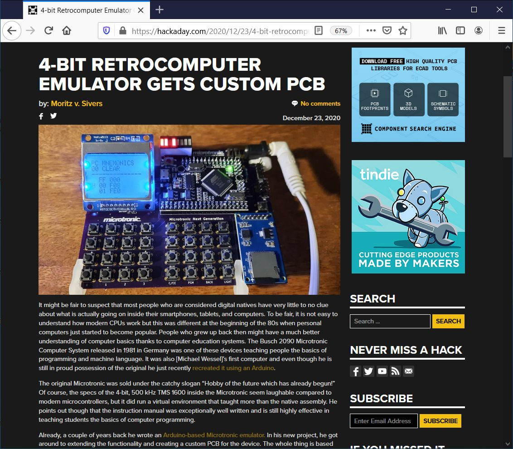 
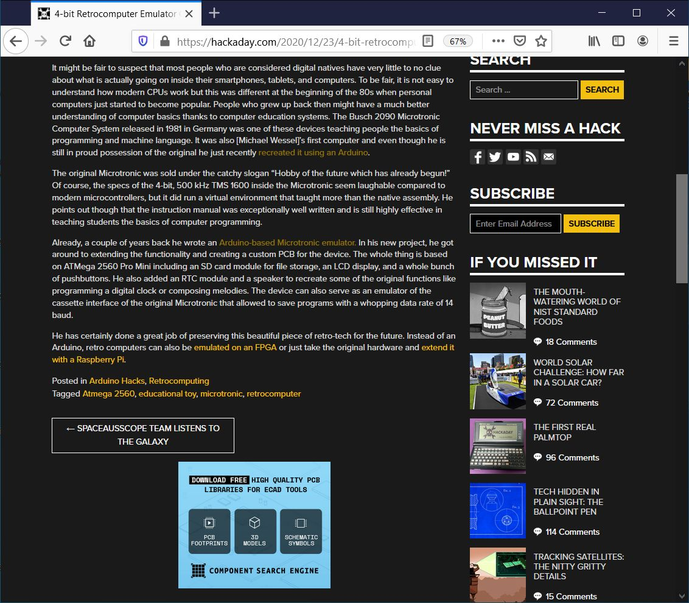 

## History 

The project started in January 2016 and is still active in January 
2021. In that time, the number of contributers increased from 1 to 6. 
See below for the different versions using different Arduino
variants and form factors. 

## Emulator Versions 

### The "Microtronic Next Generation" Project 

The current version of the Microtronic Emulator (emulator for short) is called the "Micotronic Next Generation", and it comes as a PCB. It features many improvements over the original; i.e., SDcard-based file storage, 2095 emulation, a DS3231 battery-buffered real time clock (RTC),  a big display with different display modes that facilitate machine code learning by means of a mnemonics display / dissassembler mode, sound output, a larger number of built-in ``PGM`` ROM programs including some fun games such as the Lunar Lander, and much more. It also has the 4 digital inputs (DIN ports) and 4 digital outputs (DOT ports) of the original, the 1 Hz Clock signal output, and an analog input (which is currently not used by the firmware). It can run on for 4 to 5 hours on a 9V battery. 

The current / latest version is equipped with a 1.3" OLED display (SPI SH1106): 

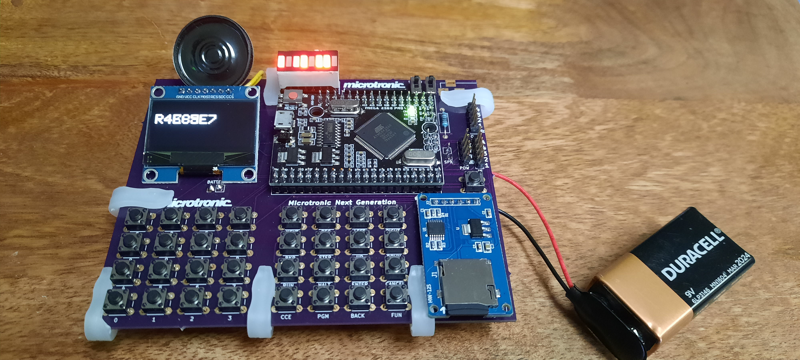 

 

The latest version of the SPI SH1106 Next Generation also has pulldown-resistors and proper feet / PCB mounting holes: 

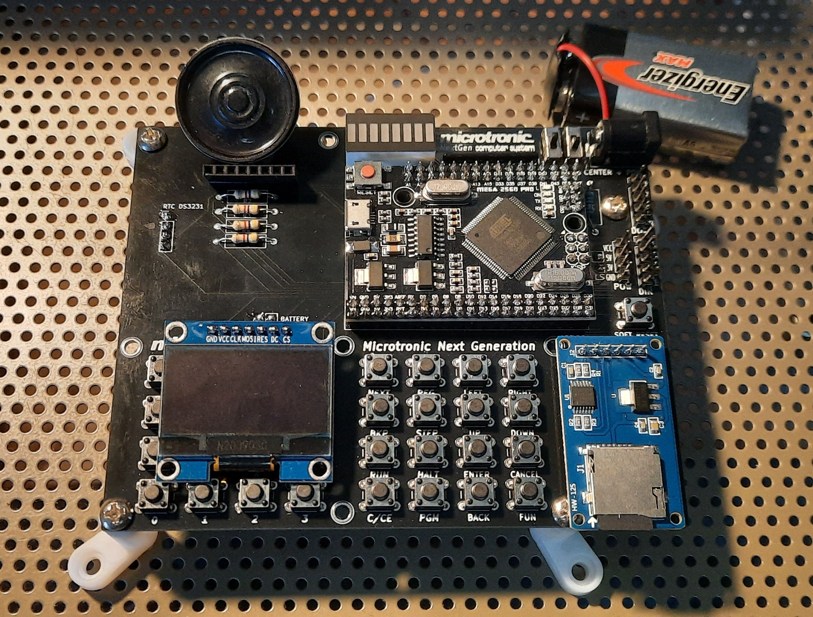 

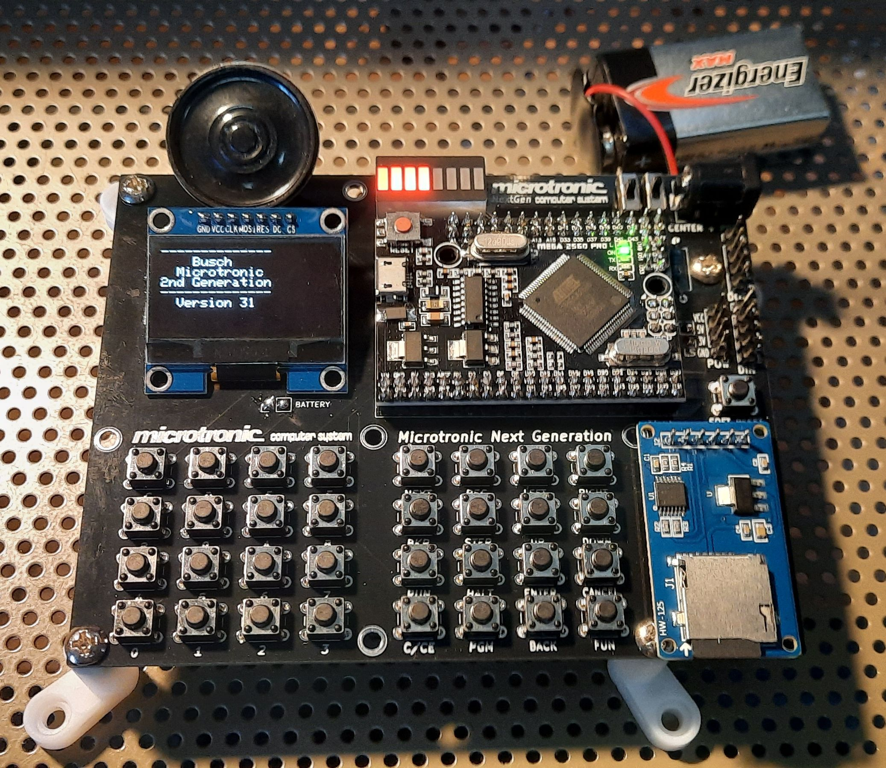 

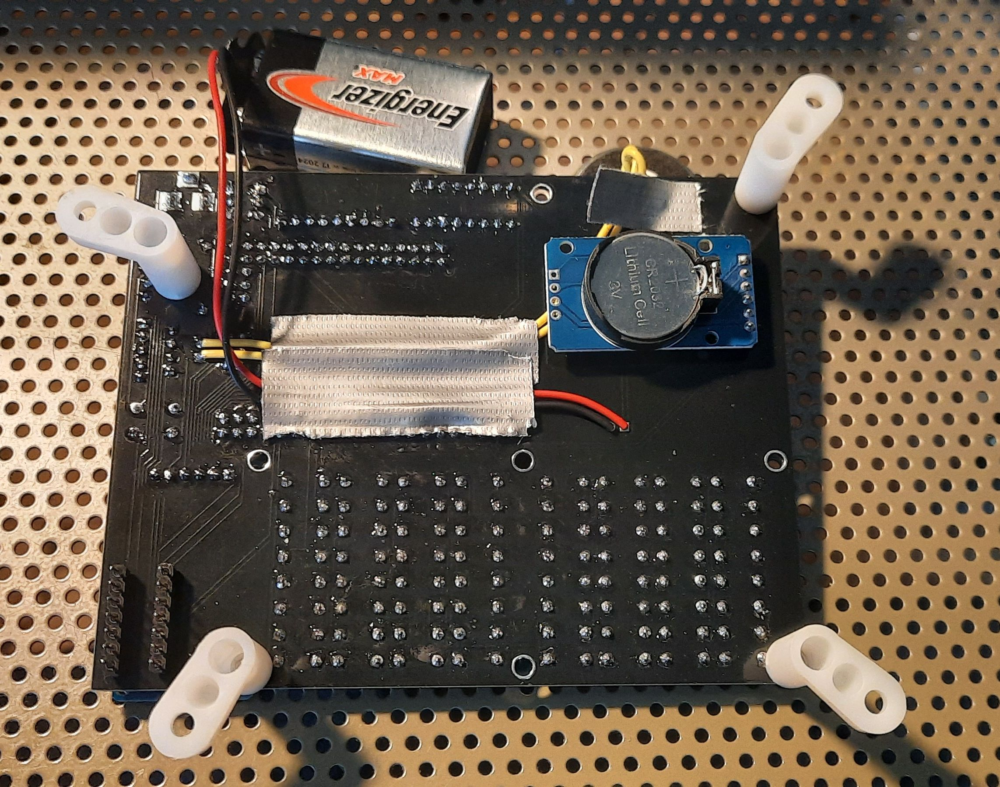 

#### Display Modes

The Microtronic Next Generation / 2nd Generation (see below) has a number of **different display modes.** The current display mode can be changed with the function keys ``LEFT, RIGHT`` and ``ENTER``. Depending on the current emulator status, additional information is shown together with the classic Microtronic 6digit 7segment display. Depending on the display mode, either the neighborhood RAM contents at the current Program Counter (``PC``) is shown (RAM locations ``PC-1``, ``PC``, and ``PC+1``), also with extra Mnemonics like a disassembler for the current PC, or the contents of the 16 work (or extra) registers. There is also a very nice "big" display mode in which the Microtronic 6digit hex output is shown in double size big font (this mode leaves no room for extra information though). 

Here the display is shown in "disassembler mode"; it shows the Mnemonic at the current ``PC``, as well as op-codes at locations ``PC-1`` and ``PC+1`` addresses. ``H`` stands for **halted**, see below. 

 

#### Status Indicators 

Regardless of the display mode, the **current status** of the emulator (running, halted, ...) is always displayed in front of the Microtronic 6digit hex display, using the following status codes: 

- ``H``: halted
- ``A``: enter address 
- ``P``: enter op-code 
- ``r``: program running 
- ``?``: keypad input from user requested  
- ``i``: entering / inspecting register via ``REG``  
- ``t`` : entering clock time (``PGM 3``) 
- ``C`` : showing clock time (``PGM 4``) 
- ``D`` : showing and/or entering date from the RTC (``PGM 0``) 

#### Function Keys 

The emulator has an **additional 8 function keys.** From left to right, top to bottom, these are:  

- ``LEFT, RIGHT``: in RUN mode, these are used for changing the display mode. The buttons are also used for cursor navigation for file name creation when saving a program to SDcard. 

- ``UP, DOWN``: in RUN mode, these buttons control the CPU emulator speed. The CPU can be throttled, i.e., delayed in order to slow down the emulation. This can be useful for programm debugging, or to achieve a more authentic behavior of the emulator: certain electronics experiments (especially those that control the digital outputs) are timinig critical and require a 2090-authentic emulation speed. In the file browser, these buttons are used for browsing / selecting the file to be loaded from SDcard. When creating a file name during the save (``PGM 2``) operation, these keys are used to determine the individual characters in the filename (in combination with ``LEFT, RIGHT, ENTER, CANCEL``). 

- ``ENTER, CANCEL``: in RUN mode, ``ENTER`` also changes the display mode. In file operations (save, load), these are frequently used as ``Yes / No`` or ``Enter / Cancel`` buttons, e.g., to cancel a save operation if a file of the same name already exist and would be overwritten, etc. These buttons are also used to answer the question during ``PGM 1`` and ``PGM 2`` whether the 2095 emulation mode is to be used, or the turbo mode for loading / saving. 

- ``BACK, FUN``: During file name creation, ``BACK`` has the function of the backspace key, i.e., it delete the character left of the cursor. Unlike the ``LEFT`` key, which only moves the cursor but leaves the character left of the cursor in place.  The ``FUN`` key currently has no function; on the Nokia 5110 Version of the emulator, this is the LCD display backlight on/off button. 

The other available keys can also be found on the original Microtronic
- the original function keys ``NEXT, REG, BKP, STEP, RUN, HALT, C/CE, 
PGM``, the hex keys for program and data input, and the ``RESET`` button
(that keeps the emulator RAM contents, unlike the Arduino reset button). 

#### Built-In PGM ROM Programs 

Like the original, it contains a number of **ROM programs** that can be loaded via the key sequence ``HALT, PGM, <HEXKEY>``. The programs are 

- ``PGM 0`` : show & set date of the battery-buffered DS3213 Real Time Clock. The original 2090 contains a test program here. 
- ``PGM 1`` : loads a ``MIC`` file from SDcard into the emulator memory, OR transfer the file contents to an original Microtronic via 2095 emulation over the wire. Note that **there is an important difference to the original** - the **program is loaded at the currently active address shown in the display (PC)!** Make sure to specify the start address before using ``PGM 1`` by means of ``HALT-NEXT-xx``, where ``xx`` is the two-digital hex start address (from ``00`` to ``FF``). Usually, ``00``. So, usually you want to use the load function as follow: ``HALT-NEXT-00-PGM-1``. This is a *useful extension to the orginal behavior, because it allows you to load "reusable" program fragments into different memory regions.* Unfortunately, the (conditional) jump instructions in the Microtronic are all absolute and not relocatable, so there is a limit to the usefulness of this feature currently. However, it is conceivable to automatically rewrite these (conditional) jump instructions during load to reflect the proper offset / load address, which is a useful extension for a future firmware update. 
- ``PGM 2`` : saves the current RAM contents to a ``MIC`` file on SDcard, or receives a program from a connected original Microtronic over the wire via the 2095 emulation. Note that, unlike ``PGM 1``, ``PGM 2`` does not care for the current address (PC), but rather dumps the whole memory contents into a ``MIC`` file. 
- ``PGM 3`` : set clock; this also sets the DS323 RTC 
- ``PGM 4`` : show clock
- ``PGM 5`` : clear memory
- ``PGM 6`` : load ``F01`` (NOPs) into memory 
- ``PGM 7`` : Nim Game 
- ``PGM 8`` : Crazy Counter 
- ``PGM 9`` : the Electronic Dice, from Microtronic Manual Vol. 1, page 10
- ``PGM A`` : the Three Digit Counter from Microtronic Manual Vol. 1, page 19 
- ``PGM B`` : moving LED Light from the Microtronic Manul Vol. 1, page 48  
- ``PGM C`` : digital input DIN Test Program
- ``PGM D`` : Lunar Lander (Moon Landing) from the Microtronic Manual Vol. 1, page 23 
- ``PGM E`` : Prime Numbers, from the "Computerspiele 2094" book, page 58
- ``PGM F`` : Game 17+4 BlackJack, from the "Computerspiele 2094" book, page 32

#### Init File on SDcard - ``MICRO.INI`` 

On startup, the emulator reads a [``MICRO.INI``](./microtronic-nextgen-sh1106-spi/MICRO.INI) file. This file contains emulator setting such as auto-save interval, initial CPU emulation speed, etc. 

Here is the default [``MICRO.INI``](./microtronic-nextgen-sh1106-spi/MICRO.INI) file; it consists of space-separated values which can be either 1 or 0 for a boolean setting / on-off switch, be a simple DECIMAL integer number, a 2digit Microtronic HEX address, or an 8.3 file name: 

    10 5 1 1 4 0 0 00 AUTO.MIC 
    CPU_DELAY CPU_DELAY_DELTA LED_BACKLIGHT KEYBEEP DISPLAY_MODE AUTOSAVE_EVERY_SECONDS AUTOSTART AUTOADDRESS AUTOLOAD_FILE 

This default init file specifies: 

- ``CPU_DELAY``: 10 ms
- ``CPU_DELAY_DELTA``: 5 ms delay increment / decrement when using the ``UP, DOWN`` buttons to control the CPU speed in RUN mode
- ``LED_BACKLIGH``: turned on via 1 (use 0 for off); only used for Nokia 5110 LCD display version 
- ``KEYBEEP``: audible key beep feedback enabled 
- ``DISPLAY_MODE``: a decimal integer number from 0 5, specifying the initial display mode. These modes correspond to the different display modes that can be selected using the ``ENTER`` or ``LEFT, RIGHT`` keys in RUN mode. 
- ``AUTOSAVE_EVERY_SECONDS``: disabled, since 0 is specified here. A value `n` means auto-save current program every `n` seconds. For autosave, the file ``AUTO.MIC`` is used. ``AUTO.MIC`` is usually also the file specified as the ``AUTOLOAD_FILE``. The specified ``AUTOLOAD_FILE`` will be read in automatically upon power-on. The user hence finds the emulator pre-loaded with the program that was last saved, either manually or automatically (using the autosave feature). 
- ``AUTOSTART, AUTOADDRESS``: set to 0 here (turned off). When set to 1, upon power on the emulator will read in the file specified under ``AUTOLOAD_FILE`` and start / run it automatically from the given ``AUTOADDRESS``. The ``AUTOADDRESS`` (``00`` by default) is a 2digit Microtronic HEX address (``00`` to ``FF``). 
- ``AUTLOAD_FILE``: the file that is automatically loaded upon startup. If you are using autosave or want to have the emulator preloaded with the last program you saved to SDcard manually, then do not change the name from the default ``AUTO.MIC``. 

The ``MICRO.INI`` file is optional and the emulator will also work without it. Moreover, the SDcard is optional as well. 

#### Emulator ``MIC``Program File Format 

The ``MIC`` ASCII file format is straightforward and can be best understood by looking at an example. Here are the first few lines of a ``MIC`` file: 

    # This is a comment
    # The @ sign can specify the address for the next op code: 
    @ 00
    
    F08
    @ 10 

    F02 
    ... 

etc. Note the ``#`` comments and the ``@`` (read as: `at address`)
sign that gives the ability to selectively load from and to address
ranges into emulator memory. This is useful for programs that load in
deltas / increments. The Microtronic manual contains a number of
programs that need to be entered in deltas or "increments"; i.e., the
[``BIORYTHM.MIC``](./software/BIORYTHM.MIC) relies on two other
programs which need to be entered / loaded first:
[``DAYS.MIC``](./software/DAYS.MIC) and
[``WEEKDAY.MIC``](./software/WEEKDAY.MIC). Consequently, you find the
first lines in [``BIORYTHM.MIC``](./software/BIORYTHM.MIC) which
starts at address ``51``, as explained in the Manual:

     # Biorythm Calculator 
     # Part 3 - Load DAYS.MIC and WEEKDAY.MIC first
     # tested 

     @ 51

     FOE
     90F
     ... 

The ``#`` and ``@`` annotations will only be found in manually curated ``MIC`` file, i.e., files that were created on a PC (or Mac) with a text editor; ``MIC`` files that are created via the ``PGM 2`` save function will never contain ``@`` nor ``#``. Instead, ``PGM 2``always writes a complete memory dump from addresses ``00`` to ``FF`` to the specified ``MIC`` file (use the arrow keys in addition with ``ENTER`` and ``CANCEL`` to specify a file name). 

#### The ``PGM 1`` (Load) and ``PGM 2`` (Save) Functions - SDCard Storage & 2095 Emulation 

Note that 
- ``PGM 1`` loads a ``MIC`` file from SDcard into the emulator memory, OR transfer the file contents to an original Microtronic via 2095 emulation over the wire. Note that **there is an important difference to the original** - the **program is loaded at the currently active address shown in the display (PC)!** Make sure to specify the start address before using ``PGM 1`` by means of ``HALT-NEXT-xx``, where ``xx`` is the two-digital hex start address (from ``00`` to ``FF``). Usually, ``00``. So, usually you want to use the load function as follow: ``HALT-NEXT-00-PGM-1``. This is a *useful extension to the orginal behavior, because it allows you to load "reusable" program fragments into different memory regions.* Unfortunately, the (conditional) jump instructions in the Microtronic are all absolute and not relocatable, so there is a limit to the usefulness of this feature currently. However, it is conceivable to automatically rewrite these (conditional) jump instructions during load to reflect the proper offset / load address, which is a useful extension for a future firmware update. 

- ``PGM 2`` : saves the current RAM contents to a ``MIC`` file on SDcard, or receives a program from a connected original Microtronic over the wire via the 2095 emulation. Note that, unlike ``PGM 1``, ``PGM 2`` does not care for the current address (PC), but rather dumps the whole memory contents into a ``MIC`` file. 

#### Emulator Sound Output and Sound Instructions 

The emulator also has a sound output: connect ``A0`` to a little speaker over a 75 Ohms resistor to GND. The speaker can play musical notes; the extra side-effect of playing a tone is assigned to otherwise vacuous Microtronic op-codes (i.e., instructions that are basically no-ops). These op-codes are: ``MOV x,x = 0xx`` (copy register x to register x), ``ADDI 0,x = 50x`` (add 0 to register x), and ``SUBI 0,x = 70x`` (subtract 0 from register x; x is a register number from ``0`` to ``F``). Also have a look at the program [SONG2.MIC](./microtronic-nextgen-sh1106-spi/SONG2.MIC) for illustration of these sound op-codes; every playable tone will be produced by this demo program. 

These sound instruction op-codes map to the following musical notes: 

    //
    // MOV 0xx: 15 Notes (0 = Tone Off!) 
    // C2, C#2, D2, D#2, E2, F2, F#2, G2, G#2, A2, B#2, B2, C3, C#3, D3
    //  1   2    3   4    5   6   7    8   9    A   B    C   D   E    F 
    //

    int note_frequencies_mov[ ] = { 65, 69, 73, 78, 82, 87, 93, 98, 104, 110, 117, 123, 131, 139, 147 };

    // ADDI 50x: 16 Notes 
    // D#3, E3, F3, F#3, G3, G#3, A3, B#3, B3, C4, C#4, D4, D#4, E4, F4, F#4
    //  0    1   2   3    4   5    6   7    8   9   A    B   C    D   E   F
    //

    int note_frequencies_addi[] = { 156, 165, 175, 185, 196, 208, 220, 233, 247, 262, 277, 294, 311, 330, 349, 370 }; 

    // SUBI 70x: 16 Notes 
    // G4, G#4, A4, B#4, B4, C5, C#5, D5, D#5, E5, F5, F#5, G5,  G#5, A5,  B#5
    //  0   1    2   3    4   5   6    7   8    9   A   B    C    D    E    F 
    // 

    int note_frequencies_subi[] = { 392, 415, 440, 466, 494, 523, 554, 587, 622, 659, 698, 740, 784, 831, 880, 932 }; 

#### 9V Battery & Switches 

The emulator runs about 4 to 5 hours on a 9V battery. One of the first signs of a weak / failing battery is a save to SDcard operation resulting in ``**ERROR**``. 
You can also use a 9 to 12 V external power supply with positive center polarity connected to the barrel jack. 

There is an on switch, and another switch can be used to turn of the loudspeaker. 
#### The 2095 Cassette Interface Emulation Setup 

Either use a flatband cable, or directly plug it into your 2090 DIP socket as follows: 

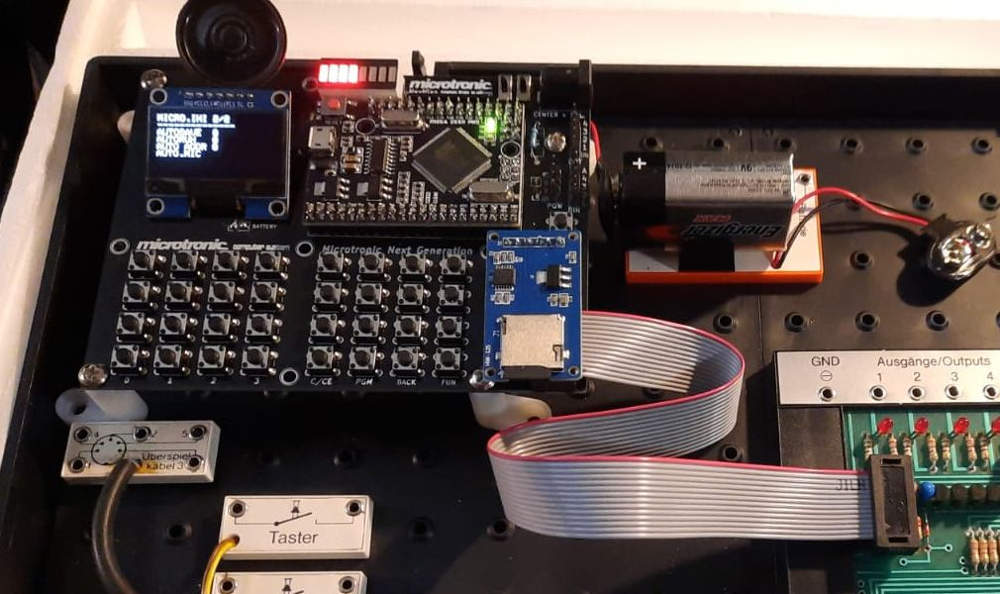

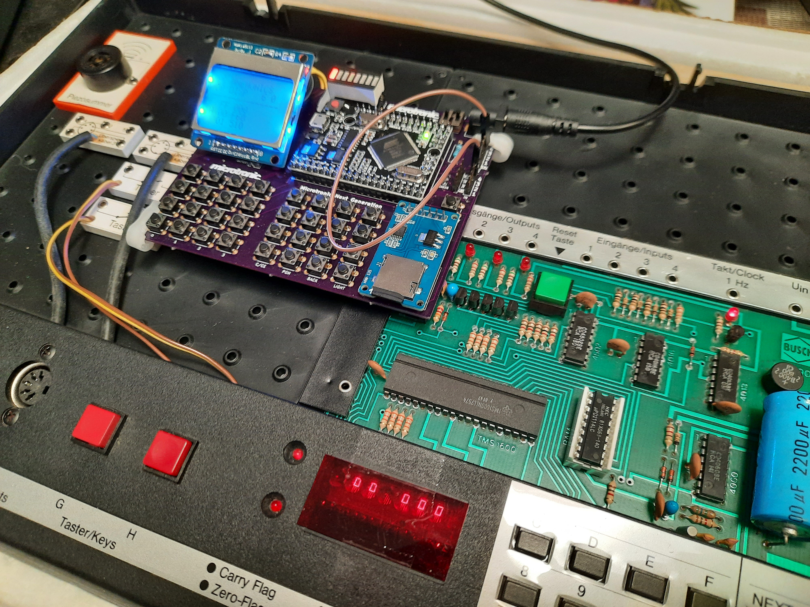 

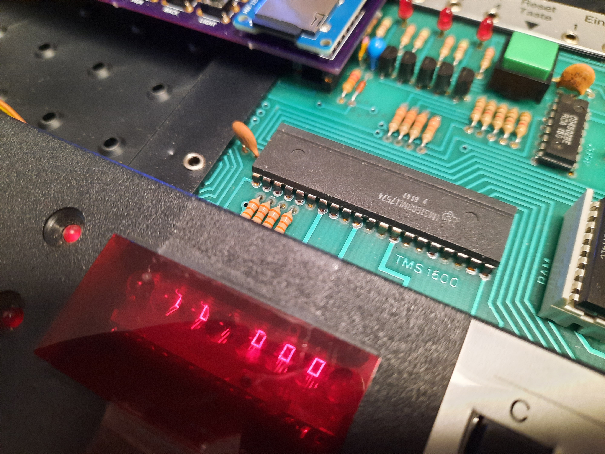 

The ``PGM 1`` and ``PGM 2`` load/save functions support 2095 emulation; just answer the "2095?" question with yes for 2095 emulation, or no for normal SDcard local file operations. 

#### Older Version of the Next Generation Emulator 

Previous versions used a Nokia 5110 display: 

 

 

### The "Microtronic 2nd Generation" Sister Project  

The "sister project", created by **Frank de Jaeger from Belgium and Manfred Henf from Germany,** ist called the **"Microtronic 2nd Generation"**. Please consider this great project if you wish to create a more professional Microtronic emulator that neatly and professionally installs into an original Busch electronics console, including a 3D-printed keyboad that mounts onto the console hole raster on the top! 

The project uses the same firmware as the "Microtronic Next Generation" presented here, but has a slightly different pin layout (i.e., requires some slight adjustments to the `hardware.h` pin configuration file). The firmware can be found in the [`microtronic-2nd-generation`](./microtronic-2nd-generation/) folder. The 2nd Generation version uses the Nokia 5110, does not support the real time clock (RTC), and does not have a 1Hz output port. 

The loudspeaker described above can also be added between A0 and GND
over a 75 Ohm resistor, as an "after market" hack / mod (it wasn't 
anticipated in the original 2nd Generation design). The same instructions for controling the speaker as documented above are used (``0xx``, ``50x``, ``70x``). 

**Thanks to Frank and Manfred for this great piece of engineering.** They also *exactly replicated the input and output transistor-stages of the original Microtronic,* so the 2nd Generation project is electrically maximally compatible with the original. It is hence the best choice for a fully compatible  Microtronic emulator that blends perfectly with the Busch electronics system, and for conducting the plenty electronics experiments described in the original Microtronic Busch manuals. 

More details about this great project can be found on the [homepage of the Microtronic 2nd Generation project.](https://www.rigert.com/ee-forum/viewtopic.php?t=2497)

*The following pictures are courtesy of Frank de Jaeger:* 

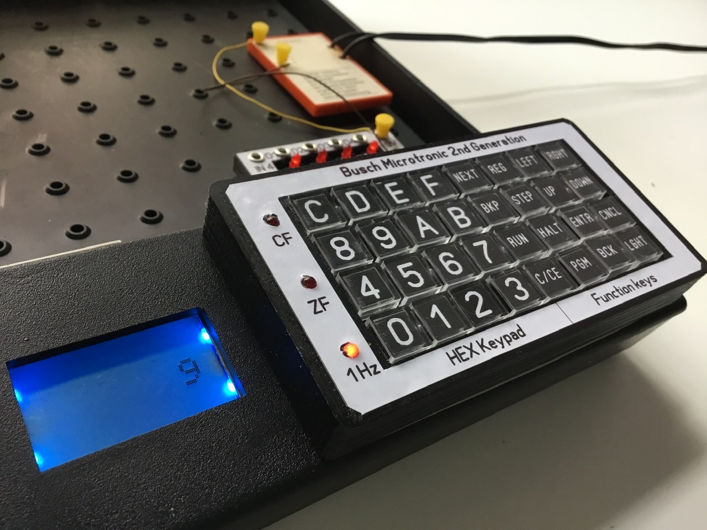
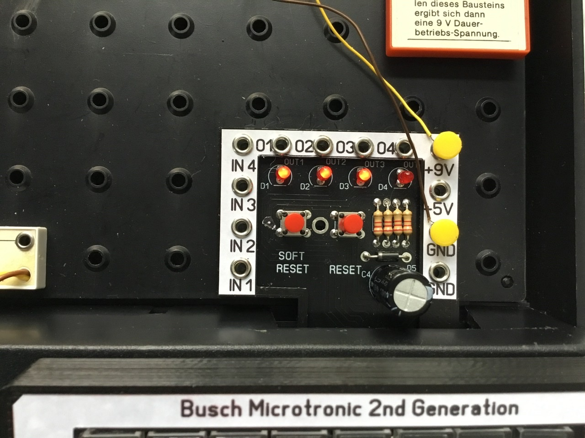

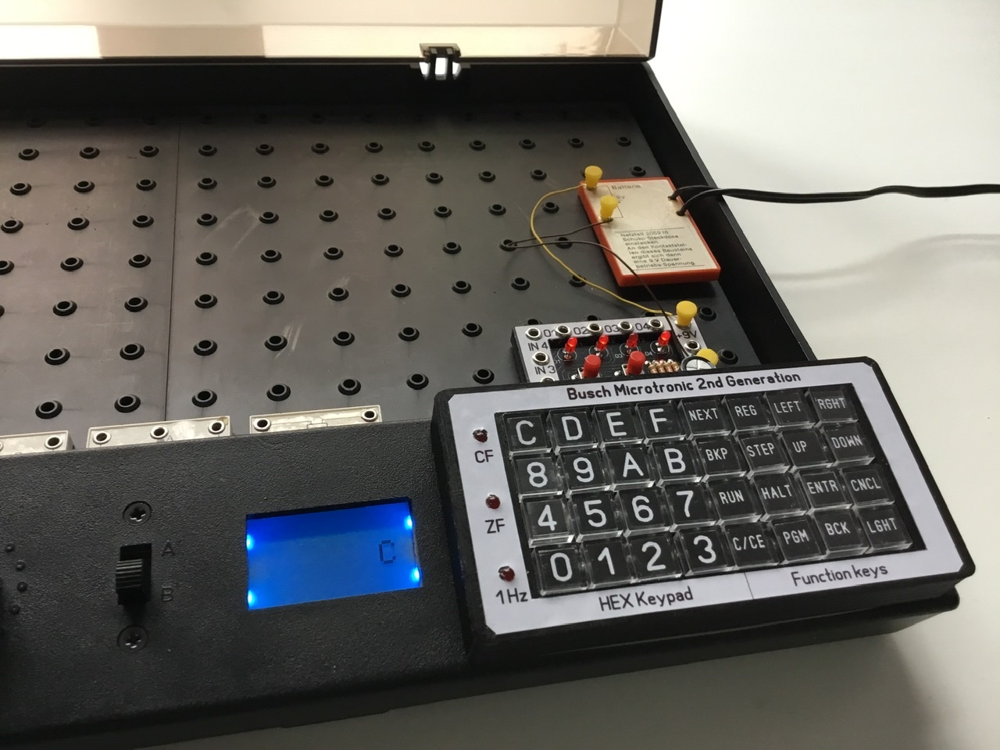

### The 2021 Arduino Uno R3 Version  

This is a new take on the 2016 Arduino Uno R3 version with some improvements over the 2016 version. 

In a nutshell, it offers: 

- High-speed Microtronic emulation with an authentic retro user experience (LED 7segment display etc.)
- Extended PGM program library in AVR ``PGMSPACE``, e.g. Blackjack, Prime Numbers, Lunar Lander, and the Nim Game. Unlike previous versions of the R3 emulator, the PGM programs are now no longer stored in the AVR's EEPROM; hence, more and longer programs can be accessed with the push of a PGM button - more fun! Note that the ``PGM-EEPROM.INO`` loader is no longer required with that version and is considered obsolete by now. 
- PGM 2 & PGM 1 functionality: the EEPROM is now used to store & restore the Microtronic memory contents! Before powering down the emulator, simply dump the current memory contents into the EEPROM via ``PGM 2``, and resume your work with ``PGM 1``. Better than a 2095 Cassette Interface! 
- Soft reset functionaliy; either via an extra push button, or the ``RUN + CCE`` key combination. 
- CPU Speed Control / Throttle: go turbo Microtronic (Prime Numbers have never been computed faster on a Microtronic!), or experience the cozy processing speed of the original Microtronic. You can either use a 10 kOhm potentiometer to dial in the speed, or use the ``RUN + <HEXKEY>`` key combination. 
- Four digital inputs for ``DIN``, and either 3 or 4 digital outputs for ``DOT`` *(note: for 4 outputs, the soft reset button has to be sacrificed).* 
- 1 Hz clock output as required for certain experiments *(note: then, the CPU speed potentiometer has to be sacrificed).* 
- Breakpoint (``BKP``) and Single Step (``STEP``) functionality: **Thanks much to Lilly (https://github.com/ducatimaus/Busch-2090) for integrating & refactoring this functionality! Great job!** 
- A simple build - you can set this up in 30 minutes.

**Thanks to Lilly (Germany) for pointing out that the R3 version was
still compiling and working (which motivated me to resurrect this
project), and for integrating & refactoring the ``BKP`` and ``STEP``
functionality!** In fact, Lilly built her own 2090 R3 emulator:
embracing the true hacker spirit, she used an old Agfa photo box and
recycled it as the emulator case! This is her emulator; it certainly
has the words "retro" and "vintage" written all over it. For more
details about her projects and the Agfa box emulator, check out her
Github [https://github.com/ducatimaus](https://github.com/ducatimaus)
that also contains a fork of the 2090 project:

Lilly has added external pulldown resistors to the digital inputs so that the logic-levels are non-inverted and hence compatible with Busch electronics kits & experiments. See below for a discussion of pulldown vs. (internal) pullup resistors. 

I also love how the documentation (IPad PDF manual) is much more modern than the computer - back in the 80s, it used to be the other way around :-) 

#### PCB Version

I am currently working on a SMD PCB version. So far, I have a prototype breadboard working. This version is basically a re-engineered version of the "LED&KEY" TM1638 module, and a shrimped Arduino Uno, i.e., an ATmega 328p with a 16 Mhz crystal. The final version will be a SMD PCB, since the TM1683 is only available in SOP-28 SMD packaging. In addition to the Uno R3 version, this variant will also feature a 24LC256 32 KByte EEPROM for PGM 2 / PGM 1 file storage; it has enough external EEPROM memory to hold 42 full memory dumps. Moreover, 2 CD4050BE bus drivers were added for the 4bit GPIOs of the Microtronic, 1 for the 4bit inputs, 1 for the 4bit outputs. 

This is the breadboad prototype: 

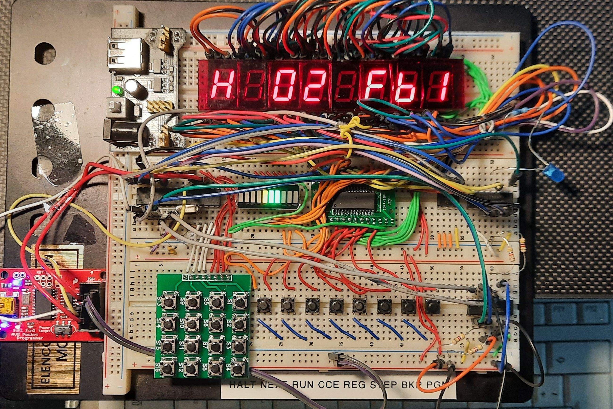

#### Hardware Requirements for the 2090 Uno R3 Version 

You will need: 

- An Arduino Uno R3 
- A TM1638 module with 8 7segment digits, 8 push buttons, and 8 LEDs 
- A 4x4 keypad with matrix encoding for hexadecimal input
- Optional: A 10k Ohm potentiometer for CPU speed / throttle control 
- Optional: A reset push button for Soft Reset 

#### Hardware Setup / Wiring 

For the Uno version:

    //
    // Uncomment this if you want 4 DOT outputs instead of 3: 
    //

    // #define RESET_BUTTON_AT_PIN_0 

    //
    // Uncomment this to use A5 for CPU speed potentiometer; ELSE this is used for 1 Hz clock output: 
    //

    // #define USE_CPU_THROTTLE_POT_AT_PIN_A5 

    //
    // TM1638 module
    //

    TM1638 module(14, 15, 16);

    //
    // Keypad 4 x 4 matrix
    //

    byte colPins[COLS] = {5, 6, 7, 8}; // columns
    byte rowPins[ROWS] = {9, 10, 11, 12}; // rows

    //
    // These are the digital input pins used for DIN instructions
    // Enable this if you want inverted inputs (INPUT_PULLUP vs. INPUT):
    // Default is non-inverted inputs by now: 

    // #define INVERTED_INPUTS 
    
    #define DIN_PIN_1 1
    #define DIN_PIN_2 2
    #define DIN_PIN_3 3
    #define DIN_PIN_4 4

    //
    // these are the digital output pins used for DOT instructions
    // (in addition to the TM1638 LEDs)
    //

    #define DOT_PIN_1 13
    #define DOT_PIN_2 17
    #define DOT_PIN_3 18
    // only used if RESET_BUTTON_AT_PIN_0 is not defined: 
    #define DOT_PIN_4 0 

    // only used if USE_CPU_THROTTLE_POT_AT_PIN_A5 is not defined: 
    #define CLOCK_1HZ A5 

    //
    // reset Microtronic (not Arduino) by pulling this to GND
    // only used if RESET_BUTTON_AT_PIN_0 is defined: 
    //

    #define RESET_PIN 0

    //
    // CPU throttle 
    // only used if USE_CPU_THROTTLE_POT_AT_PIN_A5 is defined: 
    // 

    #define CPU_THROTTLE_ANALOG_PIN A5 // center pin of 10k Ohm potentiometer
    #define CPU_THROTTLE_DIVISOR 10 
    #define CPU_MIN_THRESHOLD 10 // if smaller than this, CPU delay = 0

    // standard delay (~ original Microtronic speed) 
    int cpu_delay = 12;

    // predefined delays in ms: RUN + <HEX> 
    //                    0  1  2  3   4   5   6   7   8   9  10  11   12   13   14  15
    int cpu_delays[16] = {0, 3, 6, 9, 12, 15, 18, 21, 30, 40, 50, 80, 120, 150, 200, 500 }; 

	
#### Description 

The TM1638 "Led & Key" module is being used.  The **eight push buttons
of the TM1638 are the function keys of the Microtronic**, in this
order of sequence, from left to right: ``HALT, NEXT, RUN, CCE, REG,
STEP, BKP, PGM``:

    #define HALT  1 
    #define NEXT  2 
    #define RUN   4
    #define CCE   8
    #define REG  16
    #define STEP 32
    #define BKP  64
    #define PGM 128 

The 4x4 keypad keys are hex from `0` to `F`, in bottom-left to
top-right order. You might consider to relabel the keys on the pad 
(I haven't done that):

    7 8 9 A       C D E F 
    4 5 6 B  ==>  8 9 A B
    1 2 3 C  ==>  4 5 6 7
    * 0 # D       0 1 2 3

Unlike the original, you can use **``HALT + CCE``** (pressed
simultaneously) to **soft-reset the emulator.** Memory contents gets
preserved, unlike with the Arduino reset button.

In addition, the CPU speed ("throttle") can be set to 1 of 16 
pre-defined speeds (see ``cpu_delays[16]`` array).  To select the
**emulation speed**, use **``RUN + <HEXKEY>``** (pressed
simultaneously); speed 3 or 4 roughly corresponds to original
Microtronic speed. At slower emulation speeds, you might have to hold
these buttons pushed down for up to a second or two in order to be
effective.

Microtronic's **Carry** and **Zero** flag are the LEDs 1 and 2 of the
TM1638, the 1 **Hz clock LED** is LED 3 (from left to right). The LEDs
5 to 8 are used as **DOT outputs** (set by the data out op-code
``FEx``). 

There are also three PINs for DOT outputs: ``13``, ``A3`` and ``A4``
are used for the first 3 bits of the DOT outputs. For the 4th bit, you 
can use pin ``0``, but then the ``RESET`` button (see next paragraph) 
will have to be sacrificed (due to a shortage of R3 pins). 

The Arduino Uno pins ``D1`` to ``D4`` are read by the *data-in
instruction* ``FDx (DIN)``. Connecting these pins to VCC (3.5 V to 5
V) will set the corresponding bit to one (high). See ``PGM D`` for a
demo. Note that both the Microtronic and the emulator uses **positive
logic,** i.e. *VCC = HIGH = ~ 3.5 to 5 V = 1,* and *GND = LOW = ~ 0 V
= 0*.  In the original Microtronic, if an input is left unconnected
("floating"), then it also reads as LOW = 0.  **However, this is not
the case with the emulator - you will require external
pulldown-resistors (typical 4.7k Ohms) for ``D1`` to ``D4`` inputs.**
The inputs are configured using ``pinMode(DIN_PIN_x, INPUT)`` by
default.  Without these external pulldown resistors, floating inputs
will not quickly and reliably respond to HIGH -> LOW transitions;
floating inputs always have to be avoided, the inputs may even
oscilate.

Please note that ``Serial.begin(9600)`` interferes with with ``D1`` and
hence the ``DIN 1`` input! You will read a permanent (stuck bit) 1 if
serial logging is enabled.  So please ensure to have serial debugging
disabled when using ``D1`` for ``DIN 1``, i.e., ``Serial.begin(9600)`` is 
commented out are removed from the source. 

Please note that it is also possible to use **inverted logic**, and
then the Arduino's *internal pullup resistors can be used and no
external pulldowns will be needed,* which is the beauty of this
mode. **A note of warning though - the electric levels required for
conducting Busch electronics experiments with the emulator are not
compatible with inverted logic / inverted inputs.** To conduct Busch
electronics experiments with the emulator, you must use positive /
non-inverted logic. The corresponding switch is ``#define
INVERTED_INPUTS``. By default, it is commented out; uncomment if you
want inverted inputs. Of course, this mode is still useful for
external circuitry, e.g., to read the status of a number of push
buttons, if you design the circuit accordingly.

To summarize: if ``#define INVERTED_INPUTS`` is defined, the inputs
are configured via ``pinMode(DIN_PIN_x, INPUT_PULLUP)``, and the
**internal pullup resistors** are used, resulting in **inverted
logic** levels. If you wish to use **external pulldown resistors** for
**non-inverted logic** (like in the real Microtronic), then ensure
``#define INVERTED_INPUTS`` is commented out, i.e., not
defined. Consequently, inputs will then be configured as
``pinMode(DIN_PIN_x, INPUT)``.

The emulator also features 3 or 4 digital outputs for ``DOT`` on pins
``13, 17 (A3), 18 (A4)``, and ``0``.  Pin ``0`` is used for ``DOT``
bit 4 only if ``#define RESET_BUTTON_AT_PIN_0`` is NOT defined, i.e., 
commented out from the source code. 

Due to a shortage of GPIO pins on the R3, pin ``0`` is then used as a
soft reset pin to which you can connect a physical push
button. Connecting this to GND will reset the emulator and keep the
memory contents, unlike the reset button on the Arduino. However, you
can always preserve memory contents via ``PGM 2`` and reload via ``PGM
1``. **Note that the physical reset button is not required, as you now
also use ``HALT + CCE`` (pressed simultaneously) to soft-reset the
emulator.** It is hence suggested to use ``PIN 0`` for ``DOT`` bit 4,
and hence leave ``#define RESET_BUTTON_AT_PIN_0`` commented out, i.e.,
not defined.

Due to even more severe GPIO pin-shortage, the ``A5`` pin is either
used as a CPU speed throttle to which you can connect a potentiometer
to dial in the emulator speed, or you can use it as the ``1 Hz`` clock
output. **The latter is required for certain experiments; i.e., on page
38 in Vol. 1 of the Manual ("Timer - Der Computer als Zeitschaltuhr"),
where the ``1 Hz`` Clock Output is connected to ``DIN 4`` to provide a
1 Hz clock signal to the program.** To use ``A5`` as 1 Hz clock output,
leave ``#define USE_CPU_THROTTLE_POT_AT_PIN_A5`` commented out, i.e.,
not defined.

However, if ``#define USE_CPU_THROTTLE_POT_AT_PIN_A5`` is defined,
then analog pin ``A5`` on the Uno is used as a CPU speed
throttle. Then, connect a potentiometer to adjust the speed of the
CPU.  **Important: All three pins of the potentiometer need to be
connected!  The center pin of the potentiometer goes to ``A5``
(``CPU_THROTTLE_ANALOG_PIN``), and the outer remaining two pins
connect to ``5V (VCC)`` and ``GND``.** Otherwise, the analog input is
left "floating" and no analog value can be read. The ``analogRead``
should return a value between 0 and 1023; adjust the
``CPU_THROTTLE_DIVISOR 10`` if required. I am using a 10 kOhm
potentiometer; don't use values smaller than 1 kOhm because of the VCC
-> GND current leakage over the potentiometer.

Please note that the CPU throttle potentiometer is no longer required, 
because the emulation speed can also be specified by using the 
key combination ``RUN + <HEXKEY>`` (``0`` = fastest, ``F`` = slowest). The 
CPU throttle delay times are specified in the source code in the array
``int cpu_delays[16] = {0, 3, 6, 9, 12, 15, 18, 21, 30, 40, 50, 80, 120, 150, 200, 500 }``
(times in milliseconds). 

Unlike the original Microtronic, this emulator uses the leftmost digit
of the 8digit FM1638 to display the **current system status**; the
original Microtronic only featured a 6digit display. Currently, the
**status codes** are:

- ``H``: halted  
- ``A``: enter address 
- ``P``: enter op-code 
- ``r``: program is running 
- ``?``: keypad input from user requested  
- ``i``: entering / inspecting a register via ``REG``  
- ``t`` : entering clock time (``PGM 3``) 
- ``C`` : showing clock time (``PGM 4``) 

Moreover, unlike the original Microtronic, the emulator uses blinking
digits to indicate cursor position. The ``CCE`` key works a little bit
differently, but editing should be comfortable enough.

Typical operation sequences such as ``HALT-NEXT-00-RUN`` and
``HALT-NEXT-00-F10-NEXT-510-NEXT-C00-NEXT`` etc. will work as
expected.  Also, try to load a demo program: ``HALT-PGM-7-RUN``.

Note that programs can be entered manually, using the keypad and
function keys, or you can load a fixed ROM program specified in the
Arduino sketch via the ``PGM`` button. These ROM programs are defined
in the ``busch2090.ino`` sketch and are stored in the ``PGMSPACE``.
The ROM programs ``PGM 7`` to ``PGM F`` are defined:

The following PGM programs from ``PGM 7`` to ``PGM F`` are stored in
the sketch using ``PGMSPACE`` strings.  Note that ``PGM 1`` to ``PGM
6`` are built-in special functions that do not correspond to
``PGMSPACE`` programs. If you wish, you can exchange these ``7`` to
``F`` programs with you own:

- ``PGM 1`` : restore emulator memory from EEPROM ("core restore") 
- ``PGM 2`` : store / dump emulator memory to EEPROM  ("core dump") 
- ``PGM 3`` : set clock 
- ``PGM 4`` : show clock 
- ``PGM 5`` : clear memory
- ``PGM 6`` : load ``F01`` (NOPs) into memory 
- ``PGM 7`` : Nim Game 
- ``PGM 8`` : Crazy Counter 
- ``PGM 9`` : the Electronic Dice, from Microtronic Manual Vol. 1, page 10
- ``PGM A`` : the Three Digit Counter from Microtronic Manual Vol. 1, page 19 
- ``PGM B`` : moving LED Light from the Microtronic Manul Vol. 1, page 48  
- ``PGM C`` : digital input DIN Test Program
- ``PGM D`` : Lunar Lander (Moon Landing) from the Microtronic Manual Vol. 1, page 23 
- ``PGM E`` : Prime Numbers, from the "Computerspiele 2094" book, page 58
- ``PGM F`` : Game 17+4 BlackJack, from the "Computerspiele 2094" book, page 32

Have fun! 

## Current Arduino Sketches & Gerbers 

Please check the sub-directories
- [`microtronic-nextgen-nokia`](./microtronic-nextgen-nokia/) for the Nokia 5510 Display version, 
- [`microtronic-nextgen-sh1106-spi`](./microtronic-nextgen-sh1106-spi/) for the SH1106 SPI OLED version, 
- [`microtronic-2nd-generation`](./microtronic-2nd-generation/) for the Nokia 5110-based Microtronic 2nd Generation project, and 
- [`busch2090`](./busch2090/) for the 2021 Arduino Uno R3 version. 

The *SH1106 SPI OLED is the latest version* and we have identified this
display as the best option for the project. The Nokia 5510 is a good
choice too, but it is less reactive and gets blurry with very fast
screen updates. 

The 2nd Generation version does not support the real time clock (RTC),
and does not have a 1Hz output port. Note that the loudspeaker can be
added between A0 and GND over a 75 Ohm resistor (as an "after market"
hack / mod).

The SH1106 I2C SPI OLED was also experimented with; see
[`microtronic-nextgen-sh1106-i2c`](./obsolete/microtronic-nextgen-sh1106-i2c/).
It is **no longer supported** because it is **significantly slower than
both the Nokia 5110 and the SH1106 SPI OLED.**

Only the
[`microtronic-nextgen-sh1106-spi`](./microtronic-nextgen-sh1106-spi/)
and the [`busch2090`](./busch2090/) 2021 Arduino Uno R3 version will
be continued.  The PCB Gerbers will follow shortly.

## 2016 Versions - DEPRECATED and NOT RECOMMENDED 

**Please note that these version have note been tested recently (they
are from 2016, and Arduino has changed since then).  I strongly
recommend to use the "Micotronic Next Generation" version given above 
instead.**

[More info about these 2016 Microtronic emulator projects can be found here.](./README.old.md) 

## Required Third-Party Libraries 

Please check the [`libraries.zip`](./libraries/libraries.zip) that contains everything needed (and more) for the different Arduino emulator versions discussed here. 