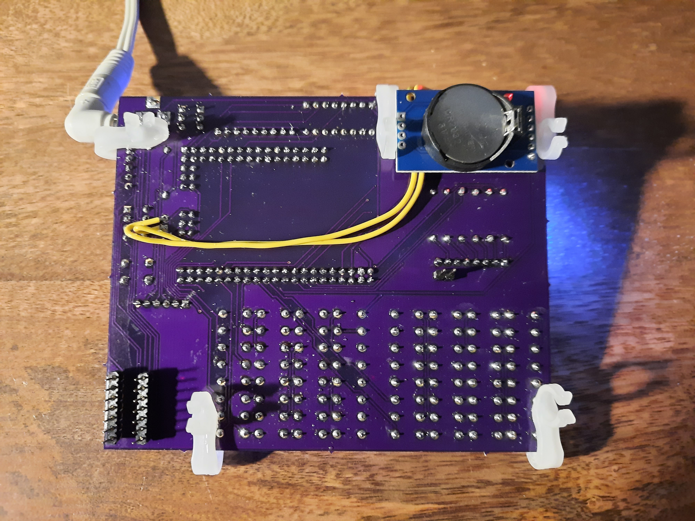
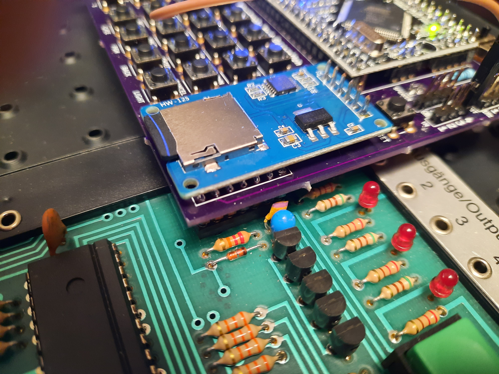

# Busch-2090
## Microtronic Emulator - The Next Generation - Nokia 5110 Display Version
### License: GPL 3

**Deprecated.** 
Please consider [the SH1106 SPI Version instead](https://github.com/lambdamikel/Busch-2090/tree/master/microtronic-nextgen-sh1106-spi). 

### PCB Version

### 2095 Cassette Interface Emulation 

### Breadboard Prototype

### YouTube Videos

[YouTube Videos](https://www.youtube.com/playlist?list=PLvdXKcHrGqhekyx81EoCwQij1Lqylp0dB) 

