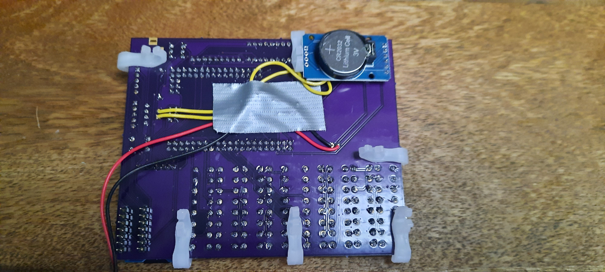
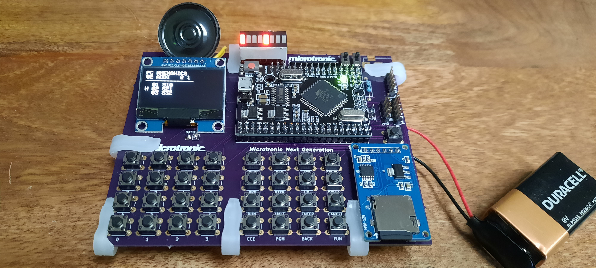
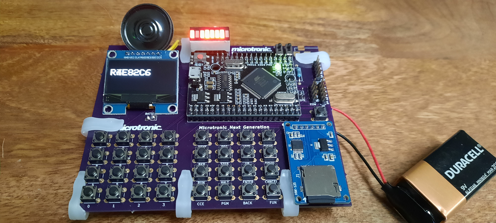
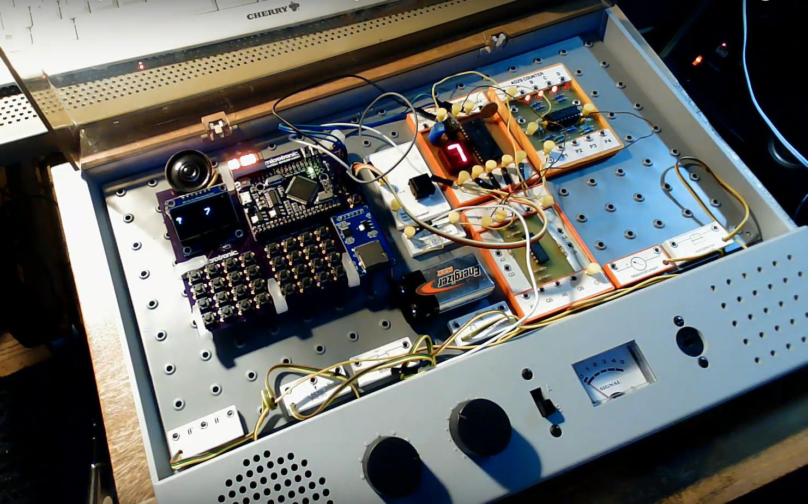
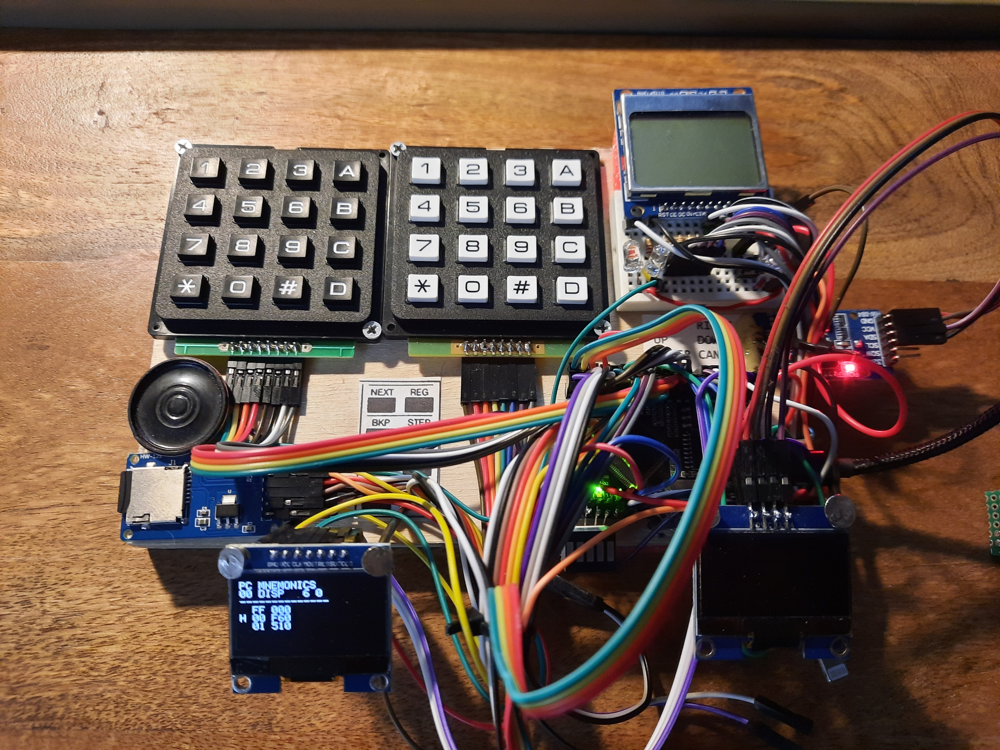
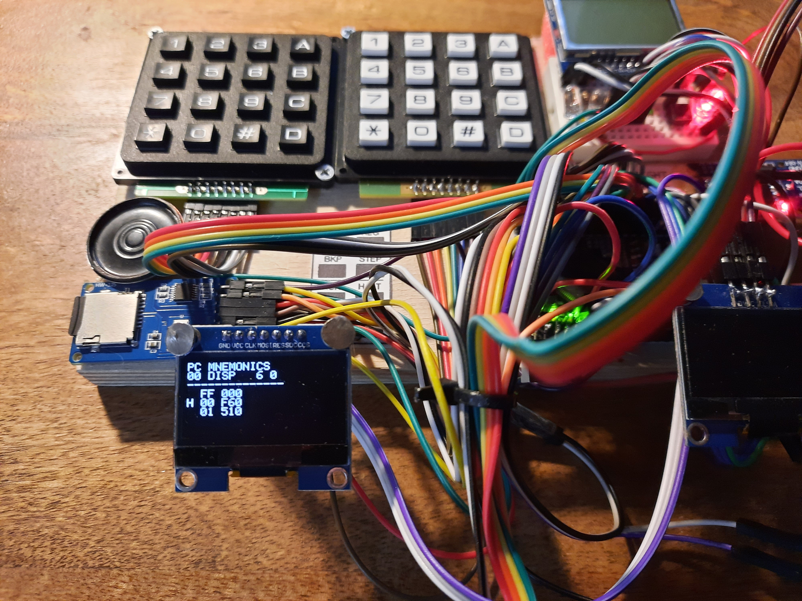
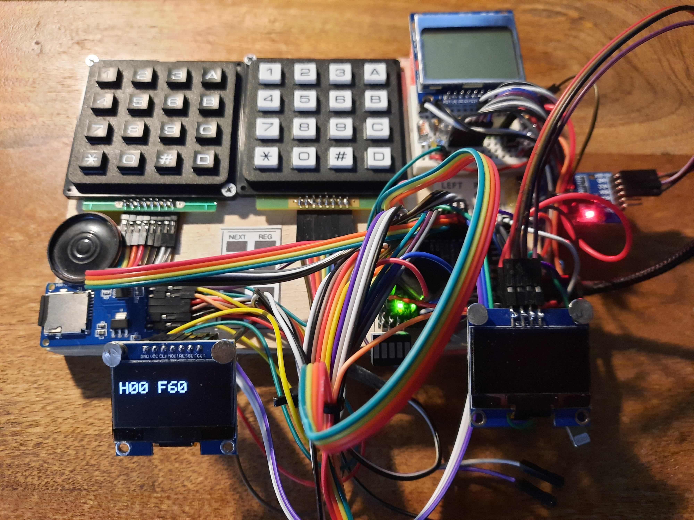
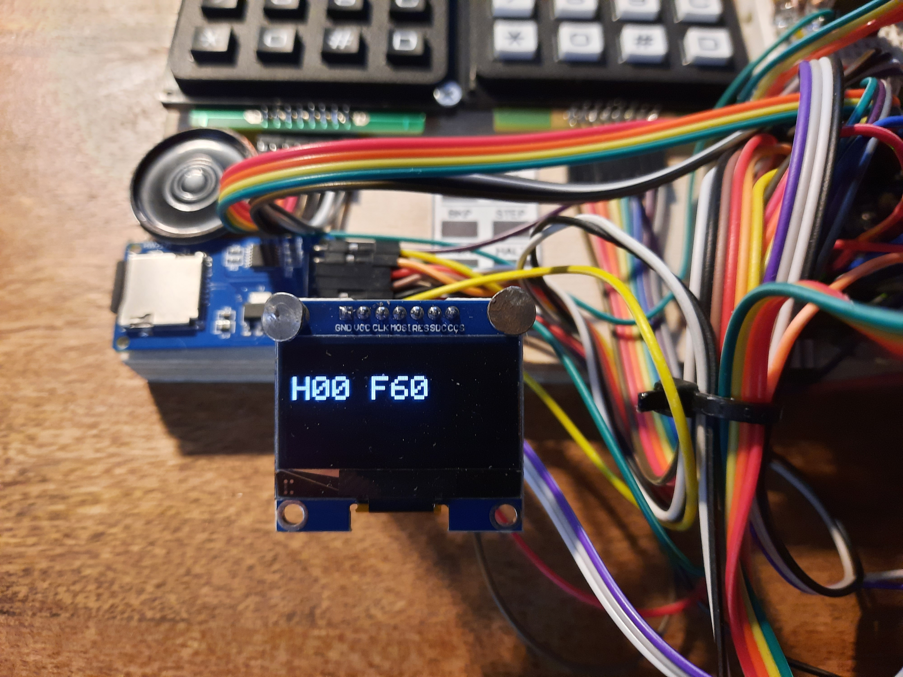

# Busch-2090
## Microtronic Emulator - The Next Generation - SH1106 SPI OLED Display Version
### License: GPL 3

Current version. 

### PCB Version

The latest version of the SPI SH1106 Next Generation also has pulldown-resistors and proper feet / PCB mounting holes: 

 

 

 

### Breadboard Prototype

### YouTube Videos

[YouTube Videos](https://www.youtube.com/playlist?list=PLvdXKcHrGqhekyx81EoCwQij1Lqylp0dB) 

